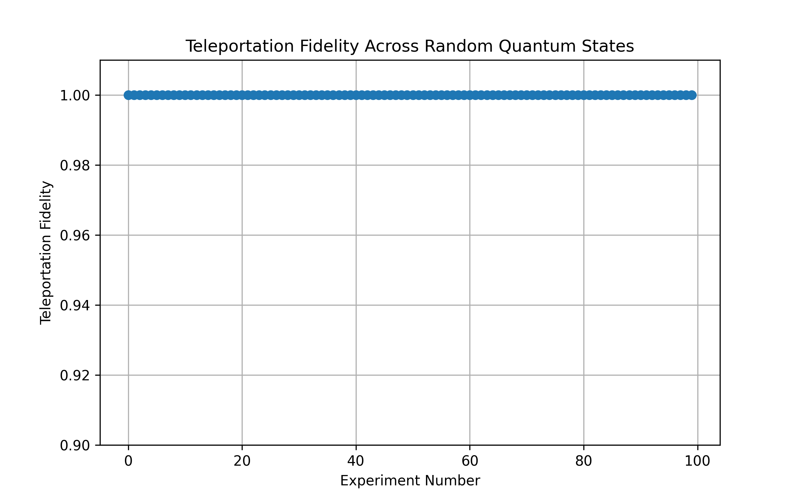
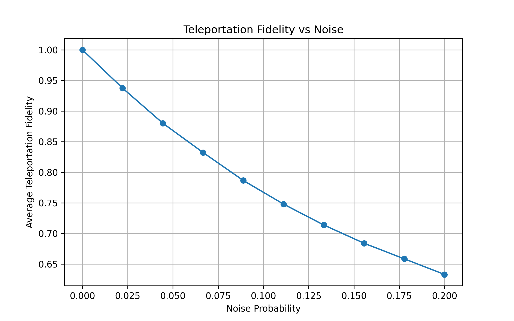

# Quantum Teleportation Simulator

A simulator of the **quantum teleportation protocol** implemented using **Qiskit**.
This project demonstrates how an unknown quantum state can be transferred using entanglement and classical communication.

The repository also evaluates teleportation fidelity across randomly generated quantum states and studies the impact of noise on teleportation performance.

---

# Overview

Quantum teleportation is one of the most important protocols in quantum communication. Instead of physically sending a qubit, the information encoded in the quantum state is transmitted using:

* quantum entanglement
* classical communication
* conditional quantum operations

This project implements the teleportation protocol and evaluates its performance through simulation.

---

# Features

* Implementation of the quantum teleportation circuit
* Teleportation of randomly generated quantum states
* Fidelity analysis of teleported states
* Bloch sphere visualization of original and recovered states
* Noise simulation to study teleportation robustness

---

# Project Structure

```
quantum-teleportation-simulator/

README.md
requirements.txt

src/
    fidelity_experiment.py
    noise_experiment.py
    teleportation_circuit.py
    teleportation_simulation.py
    visualization.py

notebooks/
    teleportation_demo.ipynb

results/
    fidelity_random_states.png
    fidelity_vs_noise.png
    alice_bloch.png
    bob_bloch.png

docs/
    teleportation_theory.md
```

---

# Quantum Teleportation Protocol

The teleportation protocol involves three qubits:

| Qubit | Role                    |
| ----- | ----------------------- |
| q0    | Alice's unknown state   |
| q1    | Alice's entangled qubit |
| q2    | Bob's qubit             |

Steps of the protocol:

1. Alice prepares an arbitrary qubit state
2. Alice and Bob share an entangled Bell pair
3. Alice performs a Bell measurement
4. Alice sends the measurement result to Bob through classical communication
5. Bob applies a corrective unitary operation

After the correction, Bob’s qubit becomes identical to Alice’s original state.

---

# Teleportation Fidelity

To verify the success of teleportation, we compute the fidelity between the original and teleported states.

```
F = |⟨ψ|φ⟩|²
```

where:

* |ψ⟩ is Alice's original state
* |φ⟩ is Bob's recovered state

A fidelity close to **1** indicates successful teleportation.

---

# Experiments

## 1. Bloch Sphere Verification

The original and teleported qubit states are visualized using Bloch spheres to verify that the states overlap.

---

## 2. Teleportation of Random Quantum States

Random quantum states are generated and teleported through the circuit. The fidelity of each teleportation run is computed.

Result: Teleportation fidelity remains close to **1** in ideal simulations.

---

## 3. Teleportation Under Noise

A depolarizing noise model is introduced to simulate imperfections in quantum hardware. Teleportation fidelity is analyzed as noise increases.

---

# Example Results

### Teleportation Fidelity Across Random States



### Teleportation Fidelity vs Noise



---

# Technologies Used

* Python
* Qiskit
* NumPy
* Matplotlib

---

# References

Bennett, C. H., et al. (1993). Teleporting an unknown quantum state via dual classical and Einstein-Podolsky-Rosen channels.

Nielsen, M. A., & Chuang, I. L. Quantum Computation and Quantum Information.

---

# Author

This project was developed as part of an exploration of quantum communication protocols using Qiskit.

